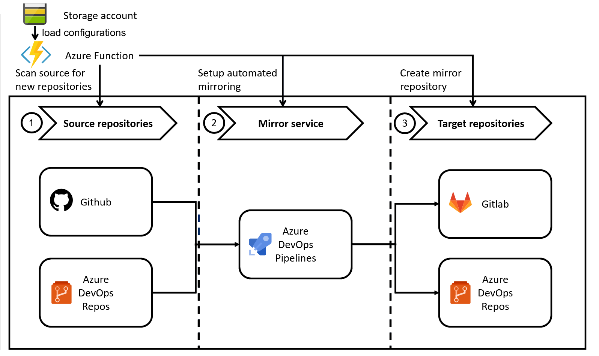

# Git mirror automation

Automate the mirroring of **public** git repositories across multiple services (such as github, gitlab & Azure DevOps).

# Motivation

A long time ago I wrote about [mirroring github, gitlab and Azure DevOps repositories](https://marcstan.net/blog/2018/08/31/Mirror-github-gitlab-and-VSTS-repositories/).

I still use this workflow (with slight improvements) to mirror repositories but it still requires a set of manual steps. I decided to [automate](https://xkcd.com/1319/) them  with this azure function.

# Manual steps this project solves

While using the automation steps described in my blog post there are still manual steps left after creating a repository in github:

* Sign into and create the same repository in Gitlab
  * Set the same description as github
* Sign into and create the same repository in Azure DevOps
* Create a new mirror build in Azure DevOps (by cloning an existing one and updating the source repository)

# How it works

The azure function runs on a schedule and uses configuration files to scan the source for any new repositories.

If new repositories are found the function uses the APIs for Azure DevOps/Gitlab to create the necessary repository/build pipelines.

Once the build pipeline exists it is triggered on every push as well as a schedule to mirror the repository.

(I use Azure DevOps builds instead of github actions because Azure DevOps allows secret sharing across pipelines).

# Overview & Supported features

The service has 3 major parts, all of them are executed as part of the Azure function once for every configuration file (loaded from storage):

* (1) Then function scans the source for new repositories
* (2) It then creates a build that automatically mirrors the repository on any future changes
* (3) And finally it creates the target repositories (with identical names)

For every newly discovered repository this infrastructure is set up automatically and since the function runs on a timer (ever 5 minutes) any new Github repository is automatically synced to the targets within 5 minutes of creation.

See [configuration](docs/Configuration.md), [supported sources](docs/Supported%20sources.md), [supported mirrors](docs/Supported%20mirrors.md) and [supported targets](docs/Supported%20targets.md) for more details on each.

# Examples

Examples can be found [here](docs/Examples.md).
