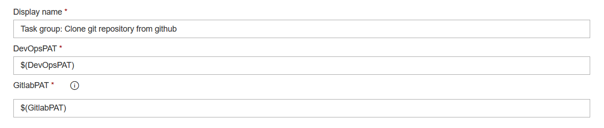

# Supported mirrors

Currently only Azure DevOps builds are supported as a mirror. Unlike Github actions they support sharing logic (via taskgroups) and secrets (via variable groups).

This makes them perfect for creating many builds (one per repository) without having the same logic duplicated many times.

**Note:** In order to create builds that use Github as a source repository you must create a [Github connection](https://docs.microsoft.com/azure/devops/boards/github/connect-to-github) in Azure DevOps.

You must thus have write permissions to the Github repository and cannot just clone arbitrary repositories (the build must install Github hooks in order to receive notifications of any changes).

If you want to clone repositories that you are not the owner of, consider [forking them](https://guides.github.com/activities/forking/).

## Setting up the build pipeline in Azure DevOps

The build is responsible for the actual cloning. We must first create a single build manually. Afterwards the Azure Function will be able to clone it for every repository at the source.

### Creating the first mirror build

Here's the instructions to create a brand new build:

In Azure DevOps create a new build/pipeline. Don't use YAML and pick the "classic editor" instead.

Connect it to Github as the source (if you don't have a github connection set up yet, this is the time to do it) or Azure DevOps - whichever you want to clone.

Pick one of your repositories as the source (all others will be cloned when the 
automation duplicates the builds).

### Configuring the mirror logic

Add a powershell step to the build and paste this script:
``` powershell
# auto fetch from github based on source
# github always sends username/repoName
$repoName = "$env:BUILD_REPOSITORY_NAME".split('/')[1]

# suppress git warnings as they produce errors in powershell
# https://github.com/dahlbyk/posh-git/issues/109
$env:GIT_REDIRECT_STDERR = '2>&1'

function Mirror-To($target) {
  # http://blog.plataformatec.com.br/2013/05/how-to-properly-mirror-a-git-repository/
  Write-Output "Mirroring to $target"
  git push --prune $target +refs/remotes/origin/*:refs/heads/* +refs/tags/*:refs/tags/*
  if ($lastexitcode -ne 0) { 
    throw "Failed to mirror"
  }
}

# ensure we have the absolute latest without any stale branches
git fetch --prune

# push to these targets
$devOpsAccount = "<devops account name>"
$devOpsProject = "<project name in your devops account>"
$gitlabUser = "<your gitlab username>"

Mirror-To "https://$(DevOpsPAT)@dev.azure.com/$devOpsAccount/$devOpsProject/_git/$repoName"
Mirror-To ("https://" + $gitlabUser + ":$(GitlabPAT)@gitlab.com/$gitlabUser/$repoName")
```
At the bottom of the script you must manually configure the targets (unfortunately this is a bit duplication to the `mirror-to` section of the configuration file).

Note that each url requires the PAT in the url as I have not implemented header authentication yet (but you are free to modify this script to your liking).

Note the `$(DevOpsPAT)` and `$(GitlabPAT)` variables in the urls. These are [Azure DevOps variables](https://docs.microsoft.com/azure/devops/pipelines/process/variables) and we will inject them from a variable group in the next step.

### Variable groups

Variable groups allows you to share variables across many builds without duplicating them. Whenever the PAT expires and needs to be renewed you will only have to update it once as all builds will link to the same group.

In the variable section of the build click on Variables -> Variable groups and click "manage variable groups".

Create a new variable group, give it a name such as "Git mirror secrets" and add variables `DevOpsPAT` and `GitlabPAT` (or whichever services you want to mirror to).

The permissions these PATs require are documented in [supported targets](Supported%20targets.md).

Be sure to **mark the variables as secret**. This will prevent them from showing up in cleartext in the logs! (Even better: [link them from a keyvault](https://docs.microsoft.com/azure/devops/pipelines/library/variable-groups#link-secrets-from-an-azure-key-vault)! This adds the benefit of being able to set an expiration date).

Now that the group is created, link it into the build.

We only have one more tab to complete in the build: Triggers.

The default trigger is to run the build for every master build of the github repository.

Enter "*" in the branch specification to tell it to run the build for every pushed change (not just the master branch).

(Optionally) also set up a scheduled build to run periodically (e.g. weekly). Some changes in the repository are not detected (such as when you push tags without pushing commits). This scheduled build ensures that they are copied over eventually.

Now save the build with a name like "[Github clone] \<repo name>" (I also placed the build in a seperate folder `Github Clones`, that way it [doesn't clutter the list of regular builds](https://dev.azure.com/marcstanlive/Opensource/_build?view=folders)).

**Pro tip:** There is one further change I recommend you make to the build: Right click the powershell task and create a taskgroup from it. In the task group then configure the variables like this:



This tells the build to forward its variables (from the variable group) to the parameters (of the same name) in the taskgroup.

The big advantage is that you will now have **one source for the script** (the taskgroup) which all cloned builds will reference.

If you ever need to make a change to the script it will be in a single place as opposed to every build.